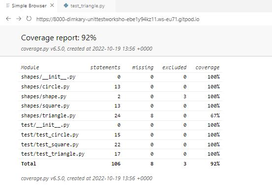
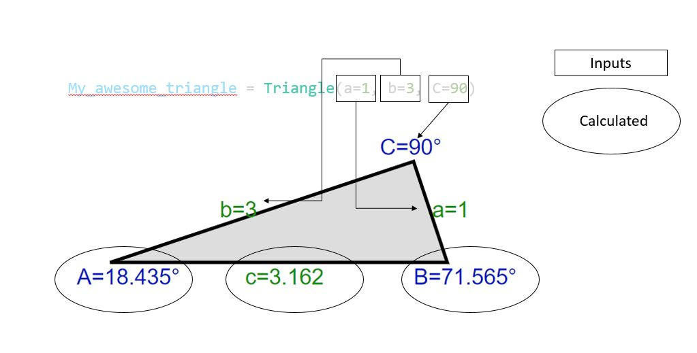

<br />
<div align="center">
  <a>
    
  </a>

  <h3 align="center">Unittest workshop with Python!!!</h3>

  <p align="center">
    A unittesting workshop using a simple library of shapes
    <br />
  </p>
</div>

## Description

This project is set up as a simple and fun excercise to write your own unittest, to test a triangle library!!! The goal is to use the skeleton code to add your test cases, until **100% coverage** is achieved. Of course more tests to cover any weird edge cases are welcome.

## Instructions
Open the project in Gitpod by going into the link: https://www.gitpod.io/#https://github.com/dimkary/unittest-workshop

The folder **shapes** contain an 4 libraries: **shape, square, circle** and **triangle**. These are used to create a respective object and provide method to calculate certain geometries (area, perimeter etc.).

At the same level there is a folder names **test**, in which there are 3 files that contain the tests for each respective shape. The goal is to add tests to the **test_triangle** file to cover as much of the triangle library as possible. The **test_circle** and **test_square** files contain already implemented tests to be used as examples.

### Check coverage
After adding new tests we want to check if they are implemented succesfully, and if the coverage has increased. From the created Gitpod environement you can run the command **run_tests** in the terminal. This will run the unittests, create the coverage report and generate an html file, which can be viewed in the idea preview browser (Simple Broswer). A coverage report on the browser should look like the picture below:
<div align="center">
  <a>
    
  </a>
</div>

### Sample triangles

In the **test_triangle** file, there are already 2 triangles, enough to test all the functionality of the library. These are the *right_Triangle* and *equilateral_Triangle*, for which you can check their geometry below. It is possible to create new triangles for your test if you wish.
<div align="center">
  <a>
    
  </a>
</div>

## Snippets
### Constructor

In order to construct your triangle using the Triangle class, you need to provide the length of **two sides** (a,b) and the angle between them. The third side and the other angles are automatically constructed:

<div align="center">
  <a>
    
  </a>
</div>

**Note:** You can complete the exercise just by using the provided sample trianles (see above).
### Triangle methods

These methods would need to be tested at least once:

  ```py
  area(self): # Returns the area of the triangle
  ```
  ```py
  perimeter(self): # Returns the perimeter of the triangle
  ```
  ```py
  isRight(self): # Returns True if one of the angles is 90 degrees
  ```
  ```py
  isEquilateral(self): # Returns True if all edges are of equal length
  ```
   
### Sample test
The tests would need to be defined **inside** the class _TestTriangle_. The tests need to be defined as function (with the **def**
 keyword) and pass the class instance as argument (with the **self** argument). If you want to use the triangles already defined, you would need to use the **self** reference before the function to be tested. Some of the assertions to be used are **assertAlmostEqual** (to test if the value is what is expected), **assertTrue** (to test whenever we expect a positive boolean value) and **assertRaises** (to check if the code fails when it is expected to fail). Examples:
 ```py
     def test_create_square_negative_length(self):
        with self.assertRaises(ValueError):
            square = Square(-1)
 ```
 ```py
    def test_diagonal_positive(self):
        square = Square(10)
        diagonal = square.diagonal()
        self.assertAlmostEqual(diagonal, 14.1421, places=3)
 ```
 ```py
     def test_trivial_true(self):
         self.assertTrue(5 == 5)
 ```
