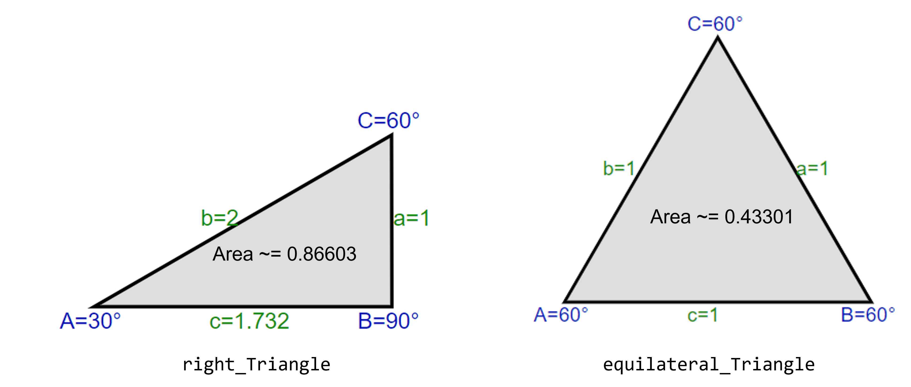

<br />
<div align="center">
  <a>
    
  </a>

  <h3 align="center">Unittest workshop with Python!!!</h3>

  <p align="center">
    A unittesting workshop using a simple library of shapes
    <br />
  </p>
</div>

## Description

This project is set up as a simple and fun excercise to write your own unittest, to test a triangle library!!! The goal is to use the skeleton code to add your test cases, until **100% coverage** is achieved. Of course more tests to cover any weird edge cases are welcome.

## Instructions
The folder **shapes** contain an 4 libraries: **shape, square, circle** and **triangle**. These are used to create a respective object and provide method to calculate certain geometries (area, parimeter etc.).

At the same level there is a folder names **tests**, in which there are 3 files that contain the tests for each respective shape. The goal is to add tests to the **tests_triangle** file to cover as much of the triangle library as possible. The **tests_circle** and **tests_square** files contain already implemented tests to be used as examples.

### Check coverage
After adding new tests we want to check if they are implemented succesfully, and if the coverage has increased. From the created Gitpod environement you can press the command **run_tests**. This will run the unittests, create the coverage report and generate an html file, which can be viewed in the idea preview browser.

### Sample triangles
In the tests file are provided already 2 triangles, enough to test all the functionality of the library. These are the *default_Triangle* and *equilateral_Triangle*, for which you can check their geometry below. It is possible to create new triangles for your test if you wish.

  <a>
    
  </a>
  
  
## Snippets

  ```sh
  pip install fastapi[all]
  ```
